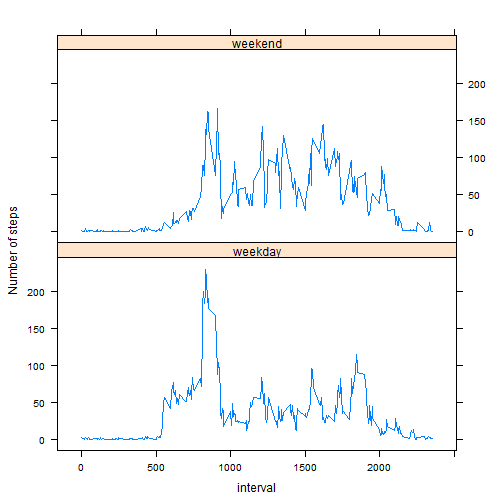

##Introduction

It is now possible to collect a large amount of data about personal movement using activity monitoring devices such as a Fitbit, Nike Fuelband, or Jawbone Up. These type of devices are part of the "quantified self" movement - a group of enthusiasts who take measurements about themselves regularly to improve their health, to find patterns in their behavior, or because they are tech geeks. But these data remain under-utilized both because the raw data are hard to obtain and there is a lack of statistical methods and software for processing and interpreting the data.

This assignment makes use of data from a personal activity monitoring device. This device collects data at 5 minute intervals through out the day. The data consists of two months of data from an anonymous individual collected during the months of October and November, 2012 and include the number of steps taken in 5 minute intervals each day.

##Dataset

The data for this assignment (Dataset: Activity monitoring data) was downloaded from the course web site:

The variables included in this dataset are:

 - steps: Number of steps taking in a 5-minute interval (missing values are coded as NA)

 - date: The date on which the measurement was taken in YYYY-MM-DD format

 - interval: Identifier for the 5-minute interval in which measurement was taken

The dataset is stored in a comma-separated-value (CSV) file and there are a total of 17,568 observations in this dataset.

##Analysis 

This assignment will be described in multiple parts. The questions and answers are detailed below. 

Before starting the analysis, load the knitr package and set global option for echo as TRUE: 

```r
library(knitr)
library(lattice)
opts_chunk$set(echo = TRUE)
```

The data file (activity.zip) was downloaded to the git repository (RepData_PeerAssessment1) and the zip file was extracted to this folder. The repdata-data-activity folder contains a csv file (activity.csv). 

###Loading and preprocessing the data
Show any code that is needed to  

1. Load the data (i.e. read.csv())  
2. Process/transform the data (if necessary) into a format suitable for your analysis  


Read activity.csv into R. Created a column datetime which has the date and interval information converted into date and time structure. And then evaluating the file structure.


```r
activity <- read.csv("./activity.csv",colClasses = c("numeric","Date","numeric"))
str(activity)
```

```
## 'data.frame':	17568 obs. of  3 variables:
##  $ steps   : num  NA NA NA NA NA NA NA NA NA NA ...
##  $ date    : Date, format: "2012-10-01" "2012-10-01" ...
##  $ interval: num  0 5 10 15 20 25 30 35 40 45 ...
```

```r
head(activity)
```

```
##   steps       date interval
## 1    NA 2012-10-01        0
## 2    NA 2012-10-01        5
## 3    NA 2012-10-01       10
## 4    NA 2012-10-01       15
## 5    NA 2012-10-01       20
## 6    NA 2012-10-01       25
```

###What is mean total number of steps taken per day?
For this part of the assignment, you can ignore the missing values in the dataset.  
 1.	Calculate the total number of steps taken per day  

**The steps per day calculated from the data**

```r
activity$date <- factor(activity$date)
countsteps <- aggregate(activity$steps, list(activity$date), sum)
colnames(countsteps) <- c("Date", "Total.Steps")
head(countsteps)
```

```
##         Date Total.Steps
## 1 2012-10-01          NA
## 2 2012-10-02         126
## 3 2012-10-03       11352
## 4 2012-10-04       12116
## 5 2012-10-05       13294
## 6 2012-10-06       15420
```
 2.	If you do not understand the difference between a histogram and a barplot, research the difference between them. Make a histogram of the total number of steps taken each day  

**Graphing the frequency of total steps in a day**

```r
hist(countsteps$Total.Steps, main = "Frequency of total steps \ntaken each day", xlab = "Total Steps taken in a day")
```

 

 3.	Calculate and report the mean and median of the total number of steps taken per day  
 
 **The mean of total steps taken per day is**

```r
mean(countsteps$Total.Steps, na.rm = TRUE)
```

```
## [1] 10766.19
```

 **The median of total steps taken per day is**

```r
median(countsteps$Total.Steps, na.rm = TRUE)
```

```
## [1] 10765
```


###What is the average daily activity pattern?  
 1.	Make a time series plot (i.e. type = "l") of the 5-minute interval (x-axis) and the average number of steps taken, averaged across all days (y-axis)  
 
 **Plotting average number of steps per time interval in a day** 

```r
avg.steps  <- aggregate(activity$steps, list(activity$interval), mean, na.rm = TRUE)
colnames(avg.steps) <- c("Time.Interval", "Avg.Steps")
plot(avg.steps$Time.Interval, avg.steps$Avg.Steps, type = "l", main = "Average number of steps per time interval in a day", xlab = "5 Min Time Intervals", ylab = "Average steps")
```

 

2.	Which 5-minute interval, on average across all the days in the dataset, contains the maximum number of steps?  

**The maximum average number of steps is during the following time interval.**

```r
avg.steps[which.max(avg.steps$Avg.Steps),]$Time.Interval
```

```
## [1] 835
```


###Imputing missing values  
Note that there are a number of days/intervals where there are missing values (coded as NA). The presence of missing days may introduce bias into some calculations or summaries of the data.  
 1.	Calculate and report the total number of missing values in the dataset (i.e. the total number of rows with NAs)  
 
**The number of missing values in the activity dataset is:**

```r
summary(activity$steps)["NA's"]
```

```
## NA's 
## 2304
```

 
 2.	Devise a strategy for filling in all of the missing values in the dataset. The strategy does not need to be sophisticated. For example, you could use the mean/median for that day, or the mean for that 5-minute interval, etc.  

Strategy: The missing values are replaced by the rounded mean of the 5-min interval.

 
 3.	Create a new dataset that is equal to the original dataset but with the missing data filled in.  
 

```r
Nactivity <- activity
Nactivity$steps[is.na(Nactivity$steps)] <- with(Nactivity, ave(steps, interval, FUN = function(x) round(mean(x, na.rm = TRUE)))[is.na(Nactivity$steps)])
head(Nactivity)
```

```
##   steps       date interval
## 1     2 2012-10-01        0
## 2     0 2012-10-01        5
## 3     0 2012-10-01       10
## 4     0 2012-10-01       15
## 5     0 2012-10-01       20
## 6     2 2012-10-01       25
```
 4.	Make a histogram of the total number of steps taken each day and 


```r
Ncountsteps <- aggregate(Nactivity$steps, list(Nactivity$date), sum)
colnames(Ncountsteps) <- c("Date", "Total.Steps")
hist(Ncountsteps$Total.Steps, main = "Frequency of total steps taken each day \n(after filling in missing values)", xlab = "Total Steps taken in a day")
```

 

Calculate and report the mean and median total number of steps taken per day.  


```r
paste("New Mean: ", mean(Ncountsteps$Total.Steps, na.rm = TRUE), "   New Median: ", median(Ncountsteps$Total.Steps, na.rm = TRUE))
```

```
## [1] "New Mean:  10765.6393442623    New Median:  10762"
```

Do these values differ from the estimates from the first part of the assignment? 


```r
paste("Old Mean: ", mean(countsteps$Total.Steps, na.rm = TRUE), "   Old Median: ", median(countsteps$Total.Steps, na.rm = TRUE))
```

```
## [1] "Old Mean:  10766.1886792453    Old Median:  10765"
```

There is a slight difference in the mean and median after filling in the missing values.  

What is the impact of imputing missing data on the estimates of the total daily number of steps?  


```r
par(mfrow=c(1,2))
hist(countsteps$Total.Steps, main = "Frequency of total steps \ntaken each day\n(Original Data)", xlab = "Total Steps taken in a day", ylim = c(0,40))
hist(Ncountsteps$Total.Steps, main = "Frequency of total steps \ntaken each day \n(after filling in missing values)", xlab = "Total Steps taken in a day", ylim = c(0,40))
```

 
The frequency of observations of the highest bar has increased significantly.


###Are there differences in activity patterns between weekdays and weekends?
For this part the weekdays() function may be of some help here. Use the dataset with the filled-in missing values for this part.  
1.	Create a new factor variable in the dataset with two levels - "weekday" and "weekend" indicating whether a given date is a weekday or weekend day.  


```r
Nactivity$weekday <- ifelse(substr(weekdays(as.Date(Nactivity$date)),1,1) == "S","weekend","weekday")
```

2.	Make a panel plot containing a time series plot (i.e. type = "l") of the 5-minute interval (x-axis) and the average number of steps taken, averaged across all weekday days or weekend days (y-axis). See the README file in the GitHub repository to see an example of what this plot should look like using simulated data.  

Had to use lattice to mimic the graph provided.


```r
Navg.steps  <- aggregate(Nactivity$steps, list(interval = Nactivity$interval, workday = Nactivity$weekday), mean, na.rm = TRUE)
#Navg.steps <- as.data.table(Navg.steps)
xyplot(x ~ interval| workday, data = Navg.steps, layout = c(1, 2), type = "l", ylab = "Number of steps")
```

 


###Submitting the Assignment
To submit the assignment:
1.	Commit the your completed PA1_template.Rmd file to the master branch of your git repository (you should already be on the master branch unless you created new ones)
2.	Commit your PA1_template.md and PA1_template.html files produced by processing your R markdown file with knit2html() function in R (from the knitr package) by running the function from the console.
3.	If your document has figures included (it should) then they should have been placed in the figure/ directory by default (unless you overrided the default). Add and commit the figure/ directory to yoru git repository so that the figures appear in the markdown file when it displays on github.
4.	Push your master branch to GitHub.
5.	Submit the URL to your GitHub repository for this assignment on the course web site.


##Notes
- The  assignment is in this single R markdown document that can be processed by knitr and be transformed into an HTML file.  
- The code used to generate the output is present in the doc using echo = TRUE.
- For the plotting aspects of this assignment, feel free to use any plotting system in R (i.e., base, lattice, ggplot2)
- Submitted this assignment by pushing  completed files into forked repository on GitHub. The assignment submission consists of the URL to the GitHub repository and the SHA-1 commit ID for the repository state.
- The GitHub repository also contains the dataset for the assignment.
